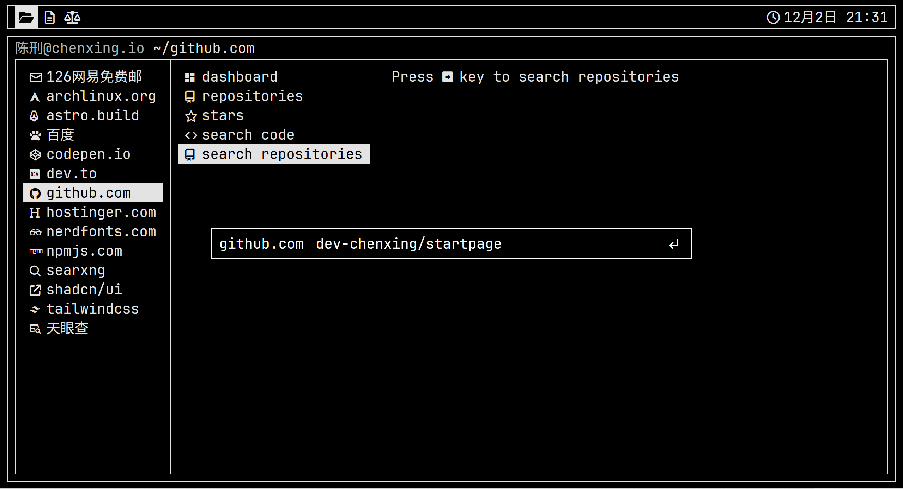

# Custom Firefox New Tab

This is a fork of [PrettyCoffee's Yet Another Generic Startpage](https://github.com/PrettyCoffee/yet-another-generic-startpage)

## How to use

1. Install Firefox extension [New Tab Override](https://addons.mozilla.org/en-US/firefox/addon/new-tab-override/?utm_content=addons-manager-reviews-link&utm_medium=firefox-browser&utm_source=firefox-browser)
2. Go to your [addons](about:addons) page, and go to the options page of New Tab Override
3. Set `https://dev-chenxing.github.io/startpage` as new tab url
